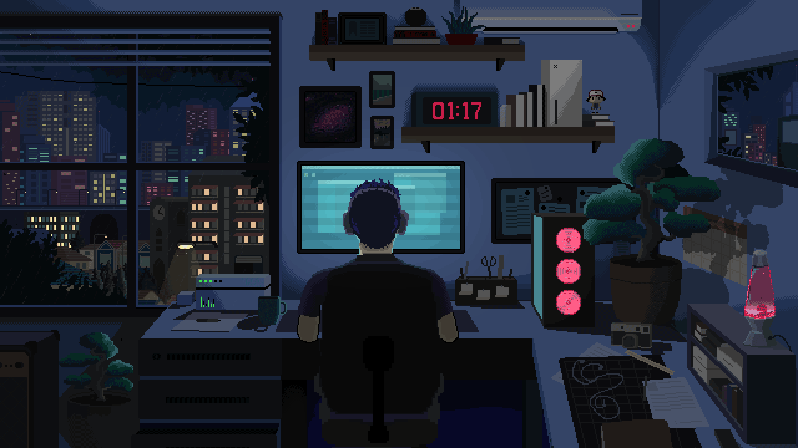

<h1 align="center">Hi 👋, I'm Lourence Lariosa</h1>

  

<h3 align="center">A Student Developer from The Philippines</h3>
 
✍️ Computer Science Major in CVSU - Main   
🌱 Currently learning Python, AI/ML and SQL  
📫 Reach me at lourencelariosa23@gmail.com  

<h2 align="center">Connect With Me!!</h2>

  
  
  

<h2 align="center">Tech Stack</h2>

  

<h2 align="center">Design Software</h2>

  

<h2 align="center">📈My Stats</h2>
   

